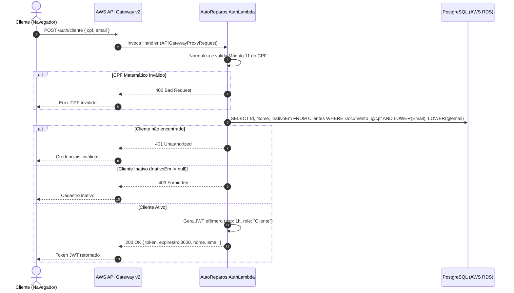

# AutoReparos - AuthLambda (Function Serverless)

> **Projeto:** AutoReparos - Sistema Integrado de Oficina Mecânica  
> **Componente:** Function Serverless de Autenticação de Clientes  
> **Fase:** Fase 3 Tech Challenge (13SOAT / 15SOAT FIAP)  
> **Stack:** C# .NET 10, AWS Lambda (`Amazon.Lambda.Core`, `Amazon.Lambda.APIGatewayEvents`), Npgsql, JWT (`System.IdentityModel.Tokens.Jwt`)

---

## 1. Propósito e Arquitetura

O **AutoReparos.AuthLambda** é uma Function Serverless autônoma responsável pelo fluxo de autenticação de clientes externos sem atrito.
O cliente final não possui cadastro de login/senha no ASP.NET Identity (que é exclusivo para os operadores internos da oficina).

Ao acessar o portal do cliente, ele informa apenas **CPF** e **E-mail**. A Lambda:
1. Higieniza e valida matematicamente o CPF através do algoritmo Módulo 11 da Receita Federal (rejeitando sequências de dígitos repetidos como `111.111.111-11`);
2. Conecta-se diretamente ao PostgreSQL gerenciado (AWS RDS) de forma segura através de consultas parametrizadas com `NpgsqlCommand`;
3. Valida a existência e o status ativo do cliente (`InativoEm IS NULL`);
4. Emite um **JWT efêmero (1 hora)** assinado com HMAC-SHA256, contendo as claims: `sub` (ClienteId GUID), `cpf`, `email` e `role: "Cliente"`.



---

## 2. Estrutura do Projeto

```
AutoReparos.AuthLambda/
├── src/
│   └── AutoReparos.AuthLambda/
│       ├── Functions/
│       │   └── ClienteAuthFunction.cs           # Handler da AWS Lambda
│       ├── Services/
│       │   ├── ICpfValidationService.cs         # Validação de CPF
│       │   ├── CpfValidationService.cs
│       │   ├── IClienteAuthDatabaseService.cs   # Consulta ao Postgres
│       │   ├── ClienteAuthDatabaseService.cs
│       │   ├── ITokenGenerationService.cs       # Emissão do JWT efêmero
│       │   └── TokenGenerationService.cs
│       └── Models/
│           ├── ClienteAuthRequest.cs            # DTO de entrada { cpf, email }
│           ├── ClienteAuthResponse.cs           # DTO de saída { token, expiresIn, nome, email }
│           └── ClienteDbRecord.cs               # Record leve de consulta
├── tests/
│   └── AutoReparos.AuthLambda.Tests/            # Suíte de 40 testes unitários com xUnit & NSubstitute
│       ├── Functions/
│       │   └── ClienteAuthFunctionTests.cs      # Testes de status HTTP (200, 400, 401, 403, 500)
│       └── Services/
│           ├── CpfValidationServiceTests.cs      # Casos de borda de CPF e sequências
│           └── TokenGenerationServiceTests.cs   # Claims, expiração e assinatura
├── .github/workflows/ci.yml                     # Pipeline CI/CD GitHub Actions
└── AutoReparos.AuthLambda.slnx                  # Solution .NET 10 autônoma
```

---

## 3. Variáveis de Ambiente Necessárias

| Variável | Descrição | Exemplo |
| :--- | :--- | :--- |
| `ConnectionStrings__DbConnection` | String de conexão para o PostgreSQL gerenciado | `Host=rds.aws.com;Database=autoreparos;Username=admin;Password=***` |
| `Jwt__Secret` | Chave simétrica compartilhada (mínimo 32 caracteres) | `sua-chave-secreta-de-producao-com-32-chars` |

---

## 4. Ambiente de Testes Local com Docker Compose

O repositório inclui um arquivo `docker-compose.yml` para executar um PostgreSQL local e validar a Lambda em ambiente isolado:

```bash
# Iniciar o PostgreSQL para testes locais da Lambda
docker-compose up -d postgres

# Construir a imagem Docker da Lambda (.NET 10)
docker build -t autoreparos-auth-lambda .
```

---

## 5. Como Executar os Testes Localmente

```bash
# Restaurar dependências e compilar
dotnet build AutoReparos.AuthLambda.slnx

# Executar suíte de 40 testes unitários com cobertura
dotnet test AutoReparos.AuthLambda.slnx
```

---

## 5. Exemplo de Chamada da API

```bash
curl -X POST https://<api-gateway-id>.execute-api.us-east-1.amazonaws.com/auth/cliente \
  -H "Content-Type: application/json" \
  -d '{
    "cpf": "12345678909",
    "email": "cliente@email.com"
  }'
```

**Resposta de Sucesso (200 OK):**
```json
{
  "token": "eyJhbGciOiJIUzI1NiIsInR5cCI6IkpXVCJ9...",
  "expiresIn": 3600,
  "nome": "Cliente Exemplo",
  "email": "cliente@email.com",
  "role": "Cliente"
}
```
